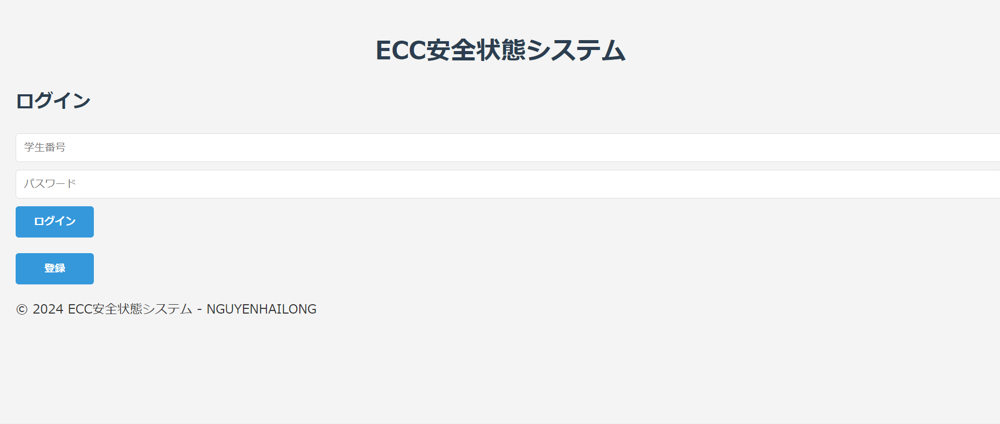

# Student Status Notification System

## Introduction
This project is a simple web application that helps notify the status of students after a disaster occurs. The application allows students to log in, report their status (safe or in danger), and view the status list of other classmates.

## Features
- **Login**: Students can log in using their student ID and password.

- **Report Status**: Students can report their status (safe or in danger).
- **View List**: Users can see a list of students along with their current status.
- **Register Account**: New students can register for an account.

## Technologies Used
- PHP
- MySQL
- HTML/CSS

## Installation
1. **Clone Repository**:
   ```bash
   git clone https://github.com/nguyenlong-github/student-status-notification-system
   ```
2. **Set Up Database**:
   - Create a MySQL database named `student_safety`.
   - Create the `students` table with the following structure:
     ```sql
     CREATE TABLE students (
         student_id VARCHAR(50) PRIMARY KEY,
         name VARCHAR(100),
         class VARCHAR(50),
         password VARCHAR(255),
         status ENUM('安全', '危険') DEFAULT '安全'
     );
     ```
3. **Configure Connection File**: Edit the `db_connect.php` file to match your database login information.

4. **Run the Application**: Deploy the application on a PHP server and access `login.php` to get started.

## Usage
- **Register**: Go to `register.php` to create a new account.
- **Login**: Use `login.php` to log into the system.
- **Report Status**: After logging in, you can report your status on `report.php`.
- **View List**: Access `home.php` to see the status of other students.

## Documentation
- [PHP Documentation](https://www.php.net/docs.php)
- [MySQL Documentation](https://dev.mysql.com/doc/)

## Contribution
If you have any questions or suggestions, please open an issue on GitHub or contact me via email.

